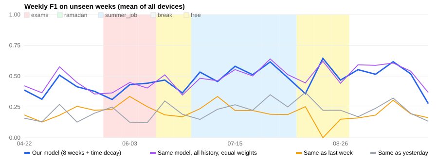

# A year of the studio — walk-forward evaluation

Simulated data: 365 days of `student_studio.toml`, 1,640,220 readings, 268 different kinds of day, 37.0% unusual days, 21.2 manual presses per day.
Training window **112 days**, time-decay half-life **28.0 days**, weeks from **2026-04-22** only (held-out: settings were chosen on earlier weeks).

Every week is predicted by a model trained only on the weeks before it (the model never sees the test week).
Weeks in which a device was used less than 2 hours are left out of the averages.

## Overall

| Method | F1 | Change within ±15 min | Exact change slot |
|---|---|---|---|
| Our model (8 weeks + time decay) | **0.468** | 72% | 51% |
| Same model, all history, equal weights | 0.484 | 71% | 53% |
| Same as last week | 0.209 | 72% | 46% |
| Same as yesterday | 0.219 | 71% | 45% |

## Per device (mean over the weeks)

| Device | Weeks | F1 Our model | F1 Same model, all history, equal weights | F1 Same as last week | F1 Same as yesterday |
|---|---|---|---|---|---|
| bathroom_light | 24 | 0.178 | 0.215 | 0.098 | 0.098 |
| bathroom_vent | 21 | 0.440 | 0.440 | 0.063 | 0.202 |
| bedroom_fan | 12 | 0.565 | 0.512 | 0.059 | 0.145 |
| bedroom_light | 24 | 0.591 | 0.594 | 0.166 | 0.111 |
| kitchen_hood | 21 | 0.199 | 0.269 | 0.097 | 0.037 |
| kitchen_light | 24 | 0.227 | 0.258 | 0.112 | 0.085 |
| living_fan | 19 | 0.775 | 0.769 | 0.392 | 0.449 |
| living_light | 24 | 0.844 | 0.855 | 0.613 | 0.614 |

## By period (does it cope with change?)

| Period | Our model | Same model, all history, equal weights | Same as last week | Same as yesterday |
|---|---|---|---|---|
| exams | 0.390 | 0.403 | 0.271 | 0.169 |
| free | 0.452 | 0.462 | 0.154 | 0.256 |
| semester | 0.457 | 0.492 | 0.199 | 0.198 |
| summer_job | 0.531 | 0.525 | 0.232 | 0.245 |

