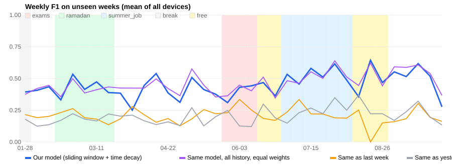

# A year of the studio — walk-forward evaluation

Simulated data: 365 days of `student_studio.toml`, 1,640,220 readings, 268 different kinds of day, 37.0% unusual days, 21.2 manual presses per day.
Training window **112 days**, time-decay half-life **28 days**.

Every week is predicted by a model trained only on the weeks before it (the model never sees the test week).
Weeks in which a device was used less than 2 hours are left out of the averages.

## Overall

| Method | F1 | Change within ±15 min | Exact change slot |
|---|---|---|---|
| Our model (sliding window + time decay) | **0.453** | 73% | 52% |
| Same model, all history, equal weights | 0.467 | 72% | 54% |
| Same as last week | 0.207 | 72% | 45% |
| Same as yesterday | 0.207 | 72% | 45% |

## Per device (mean over the weeks)

| Device | Weeks | F1 Our model | F1 Same model, all history, equal weights | F1 Same as last week | F1 Same as yesterday |
|---|---|---|---|---|---|
| bathroom_light | 36 | 0.197 | 0.223 | 0.103 | 0.088 |
| bathroom_vent | 32 | 0.395 | 0.415 | 0.057 | 0.142 |
| bedroom_fan | 12 | 0.565 | 0.512 | 0.059 | 0.145 |
| bedroom_light | 36 | 0.535 | 0.546 | 0.163 | 0.119 |
| kitchen_hood | 28 | 0.218 | 0.277 | 0.096 | 0.033 |
| kitchen_light | 36 | 0.266 | 0.271 | 0.108 | 0.086 |
| living_fan | 19 | 0.775 | 0.769 | 0.392 | 0.449 |
| living_light | 36 | 0.839 | 0.847 | 0.629 | 0.623 |

## By period (does it cope with change?)

| Period | Our model | Same model, all history, equal weights | Same as last week | Same as yesterday |
|---|---|---|---|---|
| break | 0.394 | 0.376 | 0.216 | 0.180 |
| exams | 0.390 | 0.403 | 0.271 | 0.169 |
| free | 0.452 | 0.462 | 0.154 | 0.256 |
| ramadan | 0.426 | 0.414 | 0.201 | 0.190 |
| semester | 0.439 | 0.474 | 0.201 | 0.187 |
| summer_job | 0.531 | 0.525 | 0.232 | 0.245 |

